# Gallery: nine real Friends, one per family

Captured from the live site on 2026-09-30 in visitor mode (no wallet). Left: the PET screen (name, mood, hunger, tier pips, generation band, the NFT's 64 on-chain frames animated). Right: the HOME screen, the Friend's official on-chain `tokenURI` scene, unaltered. Every value is read from Robinhood Chain at load time.

| Family | Friend | PET | HOME |
|---|---|---|---|
| Skeleton | [#63675](https://floflo777.github.io/rarefriends-nest/pet/gen/63675) | 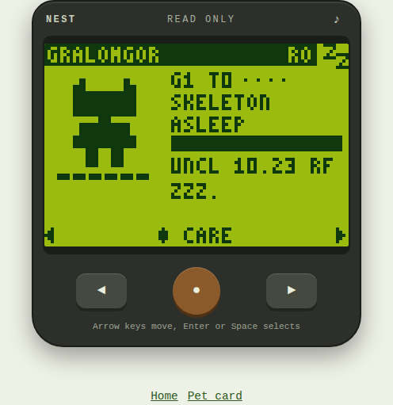 | 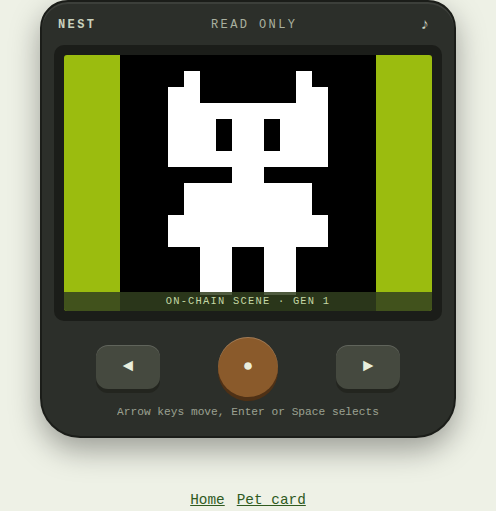 |
| Mask | [#63713](https://floflo777.github.io/rarefriends-nest/pet/gen/63713) | 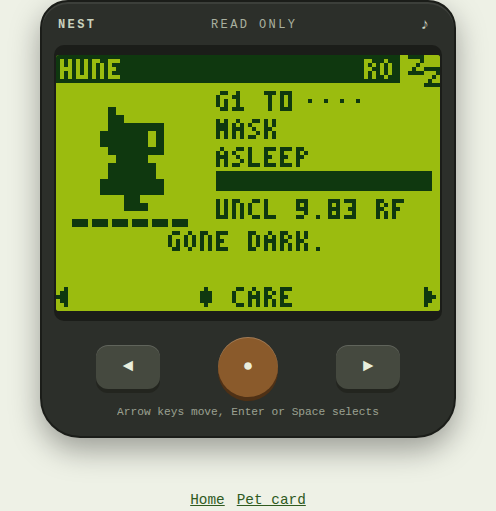 | 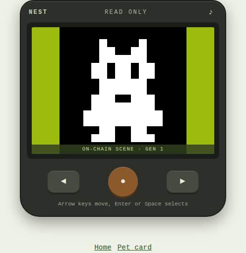 |
| Family | [#65058](https://floflo777.github.io/rarefriends-nest/pet/gen/65058) | 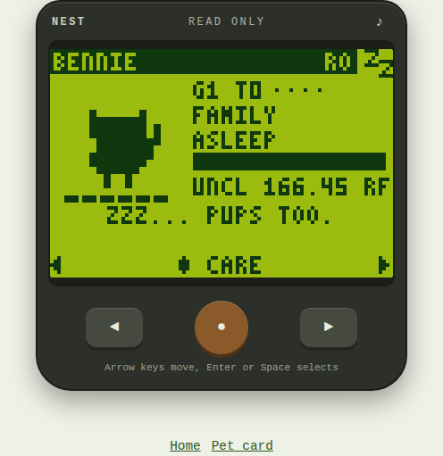 | 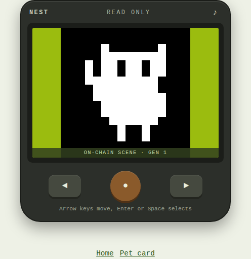 |
| Cellular | [#64981](https://floflo777.github.io/rarefriends-nest/pet/gen/64981) | 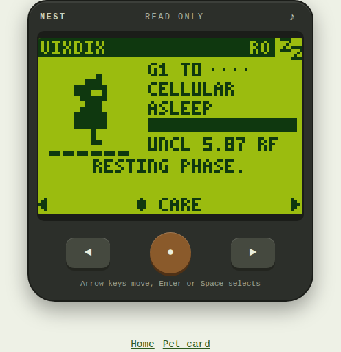 | 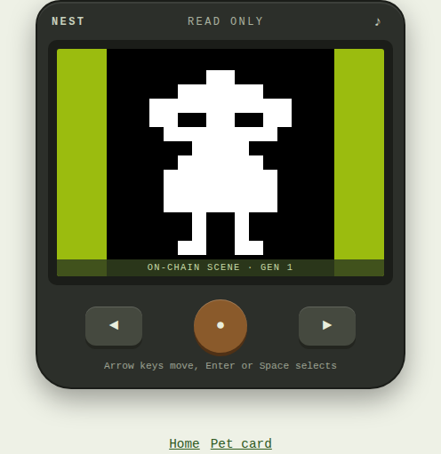 |
| Asymmetry | [#64978](https://floflo777.github.io/rarefriends-nest/pet/gen/64978) | 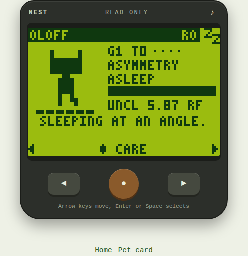 | 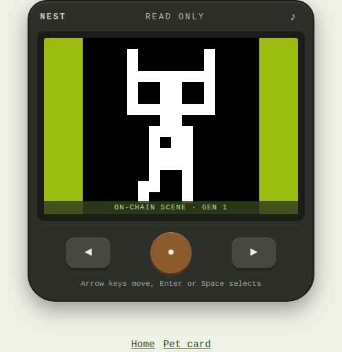 |
| Hoverer | [#65042](https://floflo777.github.io/rarefriends-nest/pet/gen/65042) | 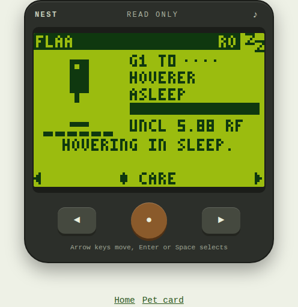 | 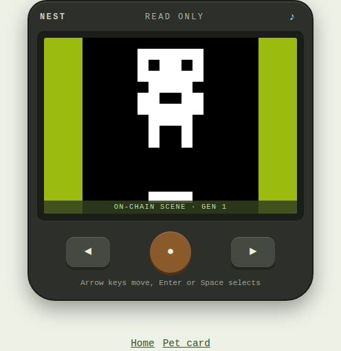 |
| Colossus | [#64998](https://floflo777.github.io/rarefriends-nest/pet/gen/64998) | 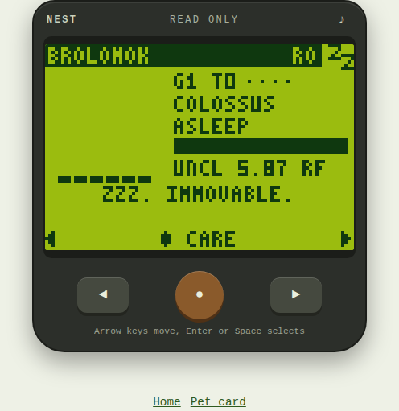 | 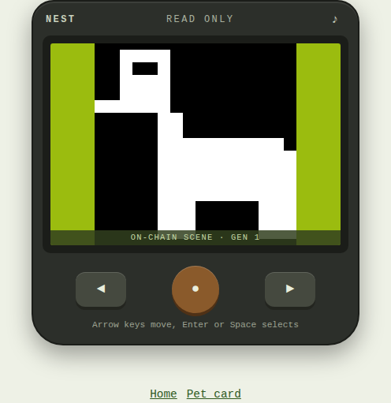 |
| Sparkling | [#65040](https://floflo777.github.io/rarefriends-nest/pet/gen/65040) | 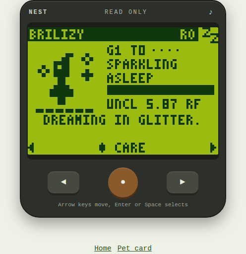 | 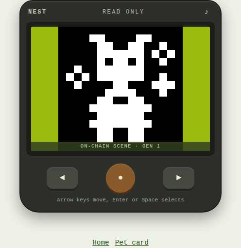 |
| Hollow | [#64940](https://floflo777.github.io/rarefriends-nest/pet/gen/64940) | 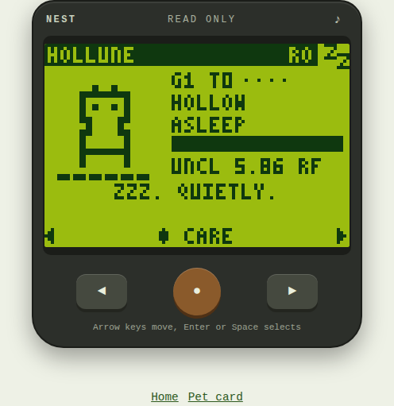 | 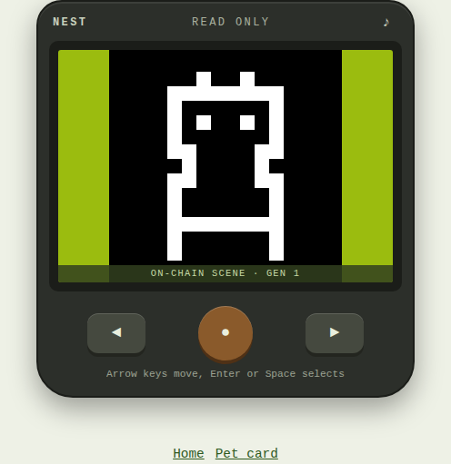 |
