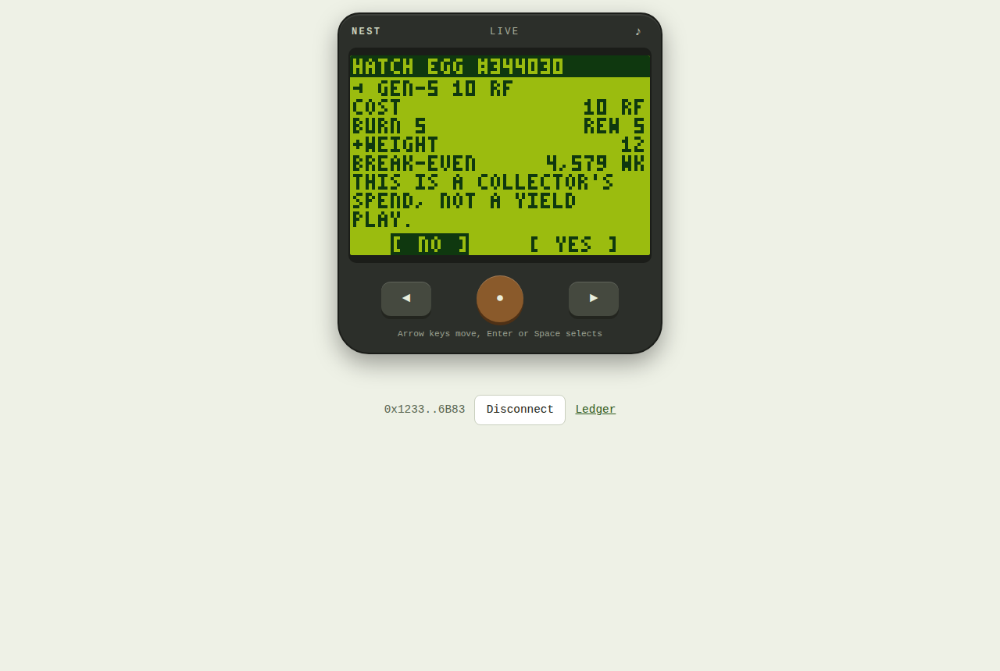
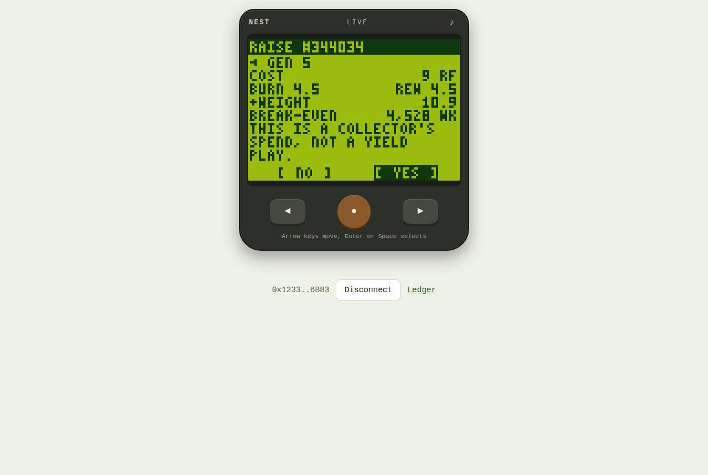
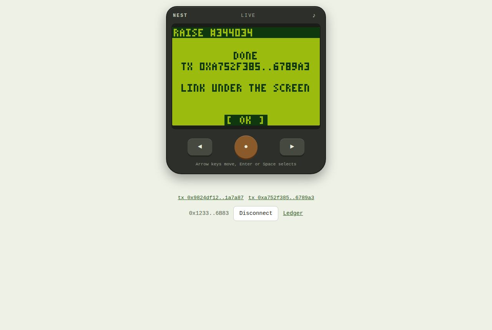

# Real-wallet playthrough, Robinhood mainnet, 2026-09-30

Every care action of the handheld except Wake (Genesis only) was run once for real, through the deployed Nest UI, from a fresh wallet that owned no Friend. 14 transactions, all carrying Nest's calldata tag, **17.5 RF burned by the protocol via Nest**. The indexer and the Ledger screen count the same 17.5 RF (5 burn events) from the chain.

## Setup, stated plainly

- **Wallet:** `0x12330Ccc005398C66CB6Bb6F4440e393593C6B83`, created for this run, funded by the builder with 0.005 ETH. It bought 66.95 RF with 0.000029 ETH in one swap ([0x7ce1af99…](https://robinhoodchain.blockscout.com/tx/0x7ce1af99e63dff357f12f14d26e7a5dd71e3b57a4c78315b12046744fbaa43c6)); the swap was sent by a script, not by Nest, and is not tagged or counted.
- **Driver:** the handheld in Chromium, pressed through its own ◄ ● ► buttons by Playwright ([act.mjs](playthrough/act.mjs)). The page gets an injected EIP-1193 wallet ([wallet.mjs](playthrough/wallet.mjs)) that answers accounts and chain id, forwards reads to the public RPC and signs `eth_sendTransaction` with the wallet's key: the same calls MetaMask answers. Nest's code path is the production one: ownership gate at a fresh block, dry-run, two-line CONFIRM defaulting to NO, then approve and the protocol call. Not tested on a phone.
- **Verification:** [receipts.mjs](playthrough/receipts.mjs) re-reads every hash from the chain (status, selector, tag, RF sent to `0x0` in the receipt). Its output is the table below. Every LCD state seen during each run is in `playthrough/trail-*.json`; screenshots are in `playthrough/shots/`.
- **One slip, kept:** the first TRAIN attempt landed on the HATCH row (the script counted the pet-name header as a menu row) and hatched a second Gen-5 Friend, #344033. The confirmation had said "HATCH EGG #344033 → GEN-5 10 RF", so the UI was right and the script was wrong; the script now checks that the cursor sits on the requested row before pressing OK.

## The run

| Step | Screen action | Protocol call | Result |
|---|---|---|---|
| 1 | HATCH #344030 (balance 66.95 RF selects Gen-5, 10 RF) | `approve` + `hardwire(5)` | Gen-5 **Mismir** (Mask), 5 RF burned |
| 2 | HATCH #344033 (the slip above) | `approve` + `hardwire(5)` | Gen-5 **Fenjo** (Asymmetry), 5 RF burned |
| 3 | TRAIN #344030 tier 0 → 1, 5 RF | `approve` + `upgrade` | weight 12 → 18.375, 2.5 RF burned |
| 4 | SAVE 31.95 RF into #344030's own wallet | RF `transfer` to the ERC-6551 account | balance drops under 10 RF, so the next egg is a Gen-6 |
| 5 | HATCH #344034 as Gen-6, 1 RF | `approve` + `hardwire(6)` | Gen-6 pup **Ditto** (Cellular), 0.5 RF burned |
| 6 | FEED #344030 (flagged TINY · NOT WORTH GAS, run anyway to prove it) | `claim(RF)` + `claim(WETH)` | dust lands in Mismir's wallet |
| 7 | WITHDRAW #344030 | ERC-6551 `execute` → RF `transfer` to the owner | 31.95 RF back in the owner's wallet |
| 8 | RAISE #344034 Gen-6 → 5, 9 RF | `approve` + `promote` | Ditto becomes Gen-5, 4.5 RF burned |

Every paid CONFIRM showed cost, burn, rewards, weight gained and the live break-even (4,309 to 4,995 weeks at the stream that started at 18:07 UTC that day), followed by "THIS IS A COLLECTOR'S SPEND, NOT A YIELD PLAY."

## Receipts (re-verified from the chain)

| # | Block | Call | Tagged | RF burned | Tx |
|---|---|---|---|---|---|
| 1 | 76716072 | approve RF | yes | 0 | [0xc63d9a34…](https://robinhoodchain.blockscout.com/tx/0xc63d9a3427e173d8ae447311c697b760781ed3d9c1d0c1fb6590b606fd7efbb8)  |
| 2 | 76716096 | hardwire | yes | 5 | [0xf1363c2a…](https://robinhoodchain.blockscout.com/tx/0xf1363c2a7bf2ebd709957d6155118b90595ed82caab2891f27393cb6af73dc34)  |
| 3 | 76716714 | approve RF | yes | 0 | [0x34bd444c…](https://robinhoodchain.blockscout.com/tx/0x34bd444cd1c31e7d8e79b515c968ace8e39053bfa0d52ee90a091ec16fb4d409)  |
| 4 | 76716732 | hardwire | yes | 5 | [0x4529abb6…](https://robinhoodchain.blockscout.com/tx/0x4529abb6756428c639a6b24aa5c3d669315e4cbafb3d51f5bd2ee06556cc9cc4)  |
| 5 | 76717095 | approve RF | yes | 0 | [0xfa9541f5…](https://robinhoodchain.blockscout.com/tx/0xfa9541f53571bbfe4da30602611870567c4389f06e42eaac5d0d6b3360f5c1d9)  |
| 6 | 76717118 | upgrade | yes | 2.5 | [0x8819361a…](https://robinhoodchain.blockscout.com/tx/0x8819361a0b40199cc331504a49e290c46513776c8d14459a96bf6753441f495d)  |
| 7 | 76717514 | RF transfer | yes | 0 | [0x6936aa89…](https://robinhoodchain.blockscout.com/tx/0x6936aa89c5506e1123180ab0db3429789c7eb781671c83ef85e740b73d222be9)  |
| 8 | 76717775 | approve RF | yes | 0 | [0x5652f774…](https://robinhoodchain.blockscout.com/tx/0x5652f7748af203f8048486842b76f08ff74fbc38629a24eac0db538b7ee97a53)  |
| 9 | 76717796 | hardwire | yes | 0.5 | [0xf7629e22…](https://robinhoodchain.blockscout.com/tx/0xf7629e2235cafe0c2f8ca454c655683e822ee3cfd0ac03284b4b337a5c1dbb4c)  |
| 10 | 76718109 | claim | yes | 0 | [0xb02d0ead…](https://robinhoodchain.blockscout.com/tx/0xb02d0ead40ddafc067773ea3dd600030474e25ac4ad0dad80afa2593dbb61c57)  |
| 11 | 76718132 | claim | yes | 0 | [0x2c8f2379…](https://robinhoodchain.blockscout.com/tx/0x2c8f23799ba024dc69254f88aecf807fb41e9589ee27cf37ac3f2b6d642949f2)  |
| 12 | 76718423 | ERC-6551 execute | yes | 0 | [0x89cc55ac…](https://robinhoodchain.blockscout.com/tx/0x89cc55ac1e16c9154fe8b2478351b14ec4344b536213a1d65bd1b05f0ce2900c)  |
| 13 | 76720316 | approve RF | yes | 0 | [0x9824df12…](https://robinhoodchain.blockscout.com/tx/0x9824df12fcc9e2cb526faad490a21cda2d97679ce82fa4c279410bc1be1a7a87)  |
| 14 | 76720334 | promote | yes | 4.5 | [0xa752f385…](https://robinhoodchain.blockscout.com/tx/0xa752f385cdf8a42600a4be75d5bc78f954ee25d41745cd51bccc89b8266789a3)  |

Total RF burned: 17.5

Reproduce: `node docs/playthrough/receipts.mjs` (read-only, public RPC, no key). Recount via Nest from scratch: `npm run index -w @nest/indexer` → `via Nest: {"burnEvents":5,"burnedRf":17.5}`.

## Screens

| Hatch confirm | Train confirm | Raise confirm | Household after |
|---|---|---|---|
|  |  |  |  |

## Not covered

- **Wake** (`activate`) needs a Genesis and 100,000 RF; it is dry-run from a real sleeping Genesis's owner in [dry-run.md](dry-run.md) and in the demo.
- **A phone and a human thumb.** The run used desktop Chromium driven by a script.
